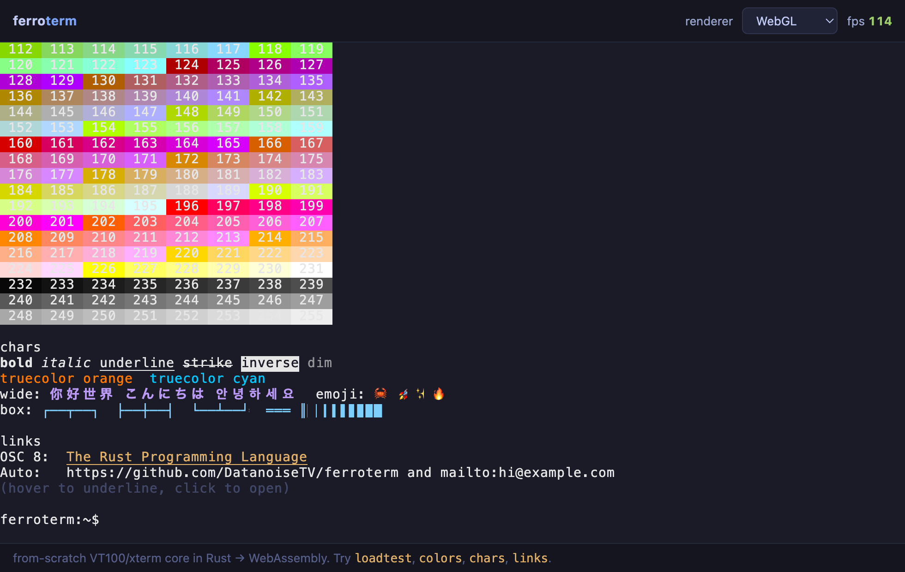
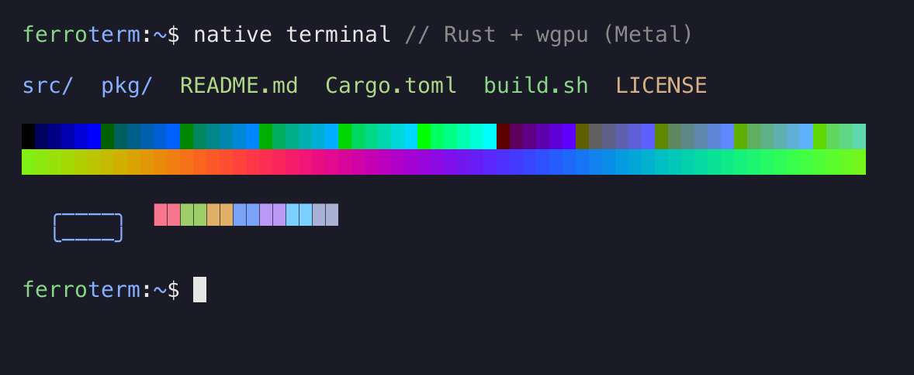

# ferroterm

A fast, secure terminal emulator **core** written from scratch in Rust, compiled
to WebAssembly, and wrapped in a small, dependency-free web component with both
**Canvas2D** and **WebGL** renderers.

<p align="center">
  
</p>


It is a clean-room reimplementation of the functionality of a browser terminal
(the problem [xterm.js](https://xtermjs.org) solves), not a fork: the escape
parser, grid model, scrollback and input encoding are all new Rust code. The
heavy lifting — parsing an untrusted byte stream into a styled grid — runs in
Rust/WASM for throughput and memory safety; the JavaScript layer only renders
and captures input.

```
┌─────────────┐   bytes    ┌──────────────────────────┐  Uint32Array   ┌───────────────┐
│  PTY / host │ ─────────▶ │  ferroterm-core (Rust →  │  snapshot ───▶ │  renderer     │
│  (or socket)│ ◀───────── │  WASM): parser + grid +  │ ◀── input ──   │  Canvas2D /   │
└─────────────┘  replies   │  scrollback + state      │   encoding     │  WebGL        │
                           └──────────────────────────┘                └───────────────┘
```

## Highlights

- **From-scratch ANSI/VT parser** following the DEC (Williams) state machine:
  CSI/OSC/DCS, SGR incl. 256-color and 24-bit true color, cursor motion, erase /
  insert / delete, scroll regions, alternate screen, DECSET/DECRST modes, and
  host replies (DSR, Device Attributes).
- **Unicode**: UTF-8 decoding with astral-plane support (emoji, CJK extensions),
  wide-character (double-width) cells, a compact East-Asian-width table, and
  **grapheme-cluster merging** — combining accents, ZWJ emoji sequences (family,
  profession), variation selectors, and regional-indicator flags collapse into a
  single cell.
- **Links**: OSC 8 hyperlinks *and* automatic URL detection, with hover-underline
  and click-to-open.
- **Dynamic palette**: OSC 4 (palette entries), OSC 10/11/12 (default fg / bg /
  cursor) and OSC 104/110/111/112 (resets) are applied live, including `?`
  color-query replies.
- **Inline images**: DCS **Sixel** (RGB + HLS colors, RLE), the **iTerm2**
  protocol (OSC 1337 `File=`, any format the browser decodes — PNG/JPEG/GIF/BMP/
  WebP) *and* the **Kitty** graphics protocol (APC `_G…`: direct RGB/RGBA/PNG
  transmission, chunked, transmit-and-display / store-and-place, delete, query)
  are composited over the grid in a renderer-agnostic overlay; images scroll with
  their text and are anchored in scrollback. Works with both renderers. Sixel and
  Kitty raw pixels are handled in the Rust core; iTerm2/Kitty PNGs are decoded
  natively by the browser (`createImageBitmap`), so no image codec is linked into
  the WASM.
- **Two renderers, swappable at runtime**: a Canvas2D renderer that redraws only
  dirty rows, and a WebGL renderer with a dynamic glyph atlas. The WebGL renderer
  keeps a persistent per-cell GPU buffer and re-uploads only the rows that
  changed, drawing the whole grid in one instanced call (one instance per cell,
  background and glyph composited in the shader) with cursor and decorations in a
  small overlay pass that visits only decorated rows. A one-row edit repaints a
  fraction of a full frame (~35× cheaper at 200×50) and a cursor-blink frame is
  essentially free (below a 100 µs timer's resolution), pixel-identical to a full
  re-render. WebGL falls back to Canvas2D when unavailable.
- **Reusable component**: `Ferroterm.create(el, opts)`, `onData` / `write`,
  theming, mouse/word/line selection, right-click menu, clipboard, bracketed
  paste, find, scrollback. Ships TypeScript types. No runtime dependencies.
- **Scales**: an engine/view split (`attachView`/`detachView`) lets a host keep
  hundreds of live terminals while only the visible ones hold a renderer, so you
  never exhaust the browser's ~16 WebGL-context limit.
- **Measured**: ~248 MB/s parse throughput (native release), sub-millisecond
  render snapshots. See [Benchmarks](#benchmarks).
- **Desktop app**: a tabbed, split-pane Tauri terminal with real PTYs, multiple
  windows, find, font zoom, and a battery + FPS HUD.

## Repository layout

| Path | What |
| --- | --- |
| `crates/core` | `ferroterm-core` — the pure-Rust terminal engine + tests + bench |
| `crates/wasm` | `ferroterm-wasm` — `wasm-bindgen` bindings |
| `web/` | the JS/TS component (renderers, input, links) + `.d.ts` |
| `examples/` | a no-backend browser demo |
| `apps/desktop/` | the Tauri tabbed-terminal application |
| `apps/native/` | the native GPU terminal (winit + wgpu, no webview) |
| `apps/slint/` | a native terminal with a Slint UI (software-rasterized) |
| `build.sh` | builds the WASM module into `web/pkg` |

## Quick start (web component)

```bash
# 1. Build the WASM module (needs the wasm32 target + wasm-bindgen-cli).
rustup target add wasm32-unknown-unknown
cargo install wasm-bindgen-cli --version 0.2.122
./build.sh                 # -> web/pkg/

# 2. Serve the repo and open a demo.
python3 -m http.server 8080
# visit http://localhost:8080/examples/            (local shell + loadtest)
#       http://localhost:8080/examples/webserial.html   (Web Serial device)
```

In your own app:

```js
import { Ferroterm } from 'ferroterm';

const term = await Ferroterm.create(document.getElementById('term'), {
  cols: 80, rows: 24, renderer: 'webgl', // or 'canvas'
});

// Wire it to a PTY over a WebSocket (your backend):
const sock = new WebSocket('wss://example/pty');
sock.binaryType = 'arraybuffer';
term.onData(bytes => sock.send(bytes));            // keystrokes -> PTY
sock.onmessage = e => term.write(new Uint8Array(e.data)); // PTY -> screen

term.onTitleChange(t => (document.title = t));
term.fit();
term.focus();
```

Or declaratively, as a real Custom Element — register the tag once, then use
`<ferro-term>` in markup. Attributes map to the options above (kebab-case), and
engine output is bridged to DOM events:

```js
import { defineFerroTermElement } from 'ferroterm';
defineFerroTermElement();          // registers <ferro-term> (idempotent)
```

```html
<ferro-term cols="80" rows="24" renderer="webgl"></ferro-term>
<script type="module">
  const el = document.querySelector('ferro-term');
  await el.ready;                                  // WASM + view are up
  el.addEventListener('data', e => sock.send(e.detail));   // keystrokes -> PTY
  sock.onmessage = m => el.write(new Uint8Array(m.data));  // PTY -> screen
  // also emits `ready`, `title` and `resize` CustomEvents; `el.terminal` is the
  // underlying engine for the full API.
</script>
```

Registration is an explicit call (not an import side effect) so the package
stays tree-shakeable. Add a boolean `fit` attribute to auto-fit the element's
box instead of using a fixed `cols`×`rows` grid.

Switch renderers live: `term.setRenderer('canvas')`. Re-theme:
`term.setTheme({ background: '#000', ansi: [...] })`.

### Options

`cols`, `rows`, `scrollback`, `fontFamily`, `fontSize`, `lineHeight`,
`renderer` (`'webgl'`|`'canvas'`), `theme`, `cursorStyle`
(`'block'`|`'bar'`|`'underline'`), `cursorBlink`, `scrollSensitivity`,
`autoFit`, `copyOnSelect`, `onLink`, `wasmUrl`. See `web/ferroterm.d.ts`.

## Using the core directly (Rust)

```rust
use ferroterm_core::Terminal;

let mut term = Terminal::new(80, 24, 1000);
term.feed(b"\x1b[31mhello\x1b[0m");
assert_eq!(term.cell_char(0, 0), 'h');

// The front-end consumes packed snapshots:
let snapshot: Vec<u32> = term.snapshot(/* force = */ false);
```

## Desktop app (Tauri)

A tabbed terminal that spawns real shells and shows a battery-runtime + FPS HUD.

```bash
./build.sh                       # build WASM first
cd apps/desktop
npm install                      # @tauri-apps/cli
npm run dev                      # sync component + `tauri dev`
```

Features and shortcuts:

| Shortcut | Action |
| --- | --- |
| Cmd/Ctrl+T / +W | new / close tab (or pane) |
| Cmd/Ctrl+1..9 | switch tab |
| Cmd/Ctrl+D / +Shift+D | split pane right / down |
| Cmd/Ctrl+N | new window |
| Cmd/Ctrl+F | find in scrollback |
| Cmd/Ctrl+K | clear |
| Cmd/Ctrl +/-/0 | font zoom in / out / reset |

Each tab/pane runs its own shell over `portable-pty`; only on-screen panes hold a
renderer. Live title updates, battery percentage + time-remaining, FPS and
throughput readouts, right-click menu, drag-resizable splits.

## Native app (no webview)

A native GPU terminal that runs the same core without a webview: **winit** owns
the window and input, **wgpu** draws the grid (Metal on macOS, Vulkan/DX12 on
Windows/Linux, GL fallback), and `portable-pty` runs the shell. The renderer
mirrors the WebGL one (one instanced draw, per-cell background + glyph
composited in a wgsl shader, glyphs rasterized into a cell atlas), and the
parser, key encoding and colors are shared verbatim with the web component via
`ferroterm-core` — so a shell looks identical native vs. in the browser.

<p align="center">
  
</p>

```bash
cd apps/native
cargo run --release          # opens a window running your $SHELL
cargo run --release --example bench   # headless renderer benchmark (real GPU)
cargo test                   # headless render test (offscreen, pixel-asserted)
```

Working: shell I/O, keyboard, 256-color + truecolor, wide/CJK cells,
**bold/italic** (real font faces where the system provides them, synthetic
shear/dilation otherwise), **underline/strikethrough**, **inline images** (Sixel
and Kitty raw RGBA drawn directly; iTerm2 and Kitty encoded images —
PNG/JPEG/GIF/BMP/WebP — decoded via the `image` crate), **mouse selection +
clipboard** (click-drag, shift-click to extend, double-click word, triple-click
line, Cmd+A / Ctrl+Shift+A to select all; **selection spans scrollback** and
auto-scrolls when the drag reaches an edge; Cmd/Ctrl+Shift+C/V to copy/paste),
**blinking cursor**, **OSC 8 hyperlinks** (hover to underline, Cmd/Ctrl-click to
open), mouse-wheel and Shift+PageUp/PageDown scrollback, resize, a
rounded-corner-safe inset. Follow-ups toward full parity: color emoji (a richer
text stack — swash/cosmic-text) and tabs/splits.

## Slint app

The same core behind a [Slint](https://slint.dev) UI instead of wgpu. Slint has
no raw per-pixel canvas element, so rather than one live element per cell (the
wrong shape for a grid) the terminal is **software-rasterized** (fontdue) into an
RGBA buffer shown as a single Slint `Image`; a `FocusScope` forwards keystrokes
through `ferroterm-core`'s encoder, and `portable-pty` runs the shell. Colors,
key encoding and the Tokyo Night theme are shared with the other front-ends, so
a shell looks the same here as in the browser or the wgpu app.

```bash
cd apps/slint
cargo run --release   # opens a Slint window running your $SHELL
cargo test            # headless: decode + rasterize pipeline, pixel-asserted
```

Working: shell I/O, keyboard (incl. arrows/F-keys/Home/End/PageUp-Down),
256-color + truecolor, wide/CJK cells, bold/italic (real faces where available,
synthetic otherwise), underline/strikethrough, inverse/dim, a blinking block
cursor, live resize and HiDPI. It is a compact reference for embedding the core
in a non-web GUI toolkit — mouse selection, scrollback viewing and inline images
are intentionally left to the fuller native app.

## Benchmarks

```bash
cargo run --release -p ferroterm-core --example bench
```

On an Apple-silicon laptop (native release build):

```
80x24:  parse 240.1 MB/s  (34 MB in 140 ms)   snapshot 0.00 ms/frame
200x50: parse 248.2 MB/s  (34 MB in 135 ms)   snapshot 0.02 ms/frame
```

The parser has an ASCII fast-path that fills line spans in bulk; plain-text
throughput is higher still. WASM runs a bit slower than native but in the same
ballpark.

### Native renderer (wgpu / Metal)

`cargo run --release --example bench` in `apps/native/` renders full-screen
frames of dense SGR content to an offscreen texture on the real GPU. On an
**Apple M5 Pro (Metal)**, 10x18 px cells:

| grid | cells | parse | CPU frame | (sustained) | GPU submit→idle |
| --- | ---: | ---: | ---: | ---: | ---: |
| 80×24 | 1,920 | 182 MB/s | 0.021 ms | ~48,000 fps | 1.97 ms |
| 120×40 | 4,800 | 149 MB/s | 0.054 ms | ~18,400 fps | 2.12 ms |
| 200×50 | 10,000 | 153 MB/s | 0.110 ms | ~9,000 fps | 2.31 ms |
| 300×80 | 24,000 | 161 MB/s | 0.275 ms | ~3,600 fps | 2.40 ms |

**CPU frame** is the render thread's real per-frame cost (snapshot decode +
instance build), ~11 ns/cell — the renderer can produce frames orders of
magnitude faster than any display refreshes, so interactive rendering is
vsync-locked (120 Hz here), never renderer-bound. GPU rasterization of the
instances is negligible; the flat ~2 ms *submit→idle* column is command-
submission + full-sync latency measured off-vsync, which double-buffering hides
in the live window. Parse throughput is lower than the ASCII numbers above
because every cell here carries a fresh 256-color SGR pair (worst case).

**Head-to-head vs. xterm.js** (same browser, identical payloads — see
[COMPARISON.md](COMPARISON.md) for methodology): ferroterm parses **1.4×–4.4×
faster** and ships in **~65 KB gzip** with both renderers *and* Sixel, reflow,
palette, search and links built in — versus xterm.js's 68 KB core alone or
~95 KB with its webgl addon. xterm.js remains more mature (larger addon
ecosystem, years of production hardening); the doc is honest about the
trade-offs.

### Slint renderer (software rasterizer)

`cargo run --release --example bench` in `apps/slint/` measures the CPU
rasterizer that backs the Slint app's `Image` renderer (its entire per-frame
cost — Slint then just uploads the finished buffer). On an **Apple-silicon
laptop**, 16 px Retina cells (physical-pixel buffer):

| grid | cells | buffer | raster (warm) | (cold cache) | frame | fill |
| --- | ---: | ---: | ---: | ---: | ---: | ---: |
| 80×24 | 1,920 | 1600×912 | 1.11 ms | 15.8 ms | ~900 fps | 1.3 Gpx/s |
| 120×40 | 4,800 | 2400×1520 | 2.89 ms | 17.6 ms | ~350 fps | 1.3 Gpx/s |
| 200×50 | 10,000 | 4000×1900 | 6.10 ms | 20.8 ms | ~165 fps | 1.2 Gpx/s |
| 300×80 | 24,000 | 6000×3040 | 14.5 ms | 28.9 ms | ~70 fps | 1.3 Gpx/s |

The single-threaded rasterizer is **fill-bound** (~1.3 Gpx/s of background +
glyph compositing regardless of grid size); snapshot decode is negligible
(microseconds). Every realistic terminal size clears 60 fps warm; the **cold
cache** column is the one-time cost of rasterizing every glyph on the first
frame (a startup hitch, then cached). It redraws the whole frame on any change —
a dirty-row partial upload is the obvious follow-up (the wgpu app already does
this).

In the browser, the demo's `benchmark` command prints parse throughput, per-
renderer paint time and a per-frame pipeline breakdown (snapshot → applySnapshot
→ render); `loadtest` measures end-to-end (parse + render) MB/s the way the
xterm.js demo does. [`examples/benchmark.html`](examples/benchmark.html) is a
standalone page that reports the detected GPU (real hardware vs a software
fallback), then the same render / pipeline / incremental timings as tables plus
copyable JSON.

## Testing

```bash
cargo test -p ferroterm-core          # 50+ behavioral conformance + unit tests
cd web && npm test                    # headless-Chrome renderer regression tests
```

The core tests assert against the *visible grid state* (what a renderer would
draw), which is the strongest check for an emulator: printing/wrapping, cursor
motion, erase/scroll regions, SGR (incl. true color), alt-screen isolation, wide
chars, astral emoji, grapheme clusters (combining marks, ZWJ sequences, flags),
OSC titles, OSC 8 links, Sixel / iTerm2 (OSC 1337) / Kitty (APC `_G`) image
placement, DSR/DA replies, and a fuzz-style "malicious input must not panic/hang"
case.

The renderer tests (`web/test/`, `CHROME_BIN` overridable) render a feature-rich
scene through **both** renderers in headless Chrome and assert semantic per-cell
pixel colors, same-renderer determinism, WebGL incremental-vs-full parity, and
that an iTerm2 inline image decodes and draws to the exact expected pixel. CI
runs `cargo fmt --check` + `clippy -D warnings` + `cargo test` and this suite.

## Design notes

- **One snapshot per frame.** Crossing the WASM boundary per cell is slow, so the
  core serializes changed rows into a single `Uint32Array`
  (`[magic, cols, rows, curX, curY, curFlags, nRows, {rowIndex, cells…}…]`,
  6 words per cell — `[codepoint, fg, bg, flags, link, grapheme]`) that the JS
  model decodes once. Only dirty rows are emitted.
- **Deferred wrap.** Printing into the last column sets a pending-wrap flag rather
  than wrapping immediately, matching real DEC terminals. Auto-wrapped rows carry
  a `wrapped` flag so resize can rejoin and re-split them (reflow) without
  merging hard line breaks.
- **Bounded input.** Parameter counts, intermediates and OSC payloads are capped
  so hostile sequences can't exhaust memory; every parser loop advances.
- **Safety at the boundary.** All untrusted bytes are parsed in memory-safe Rust;
  the JS layer never interprets escape sequences itself.

## Known limitations (honestly)

- **Kitty graphics: the common subset, not the whole protocol.** Direct base64
  transmission (`t=d`) of RGB/RGBA/PNG, chunked transfers, transmit-and-display,
  store-then-place by id, delete and query all work — enough for `kitten icat`
  and similar. Not implemented, and refused cleanly so the stream stays in sync:
  file / shared-memory transmission (`t=f|t|s`, which would let an escape read
  host files), zlib-compressed payloads (`o=z` — no inflate is linked in),
  animation, Unicode placeholders and relative/z-index placement.
- **No programming ligatures.** Correct ligature shaping needs a font shaper
  (GSUB/HarfBuzz) and a run-based renderer; a per-cell heuristic would misrender
  as often as it helped, so it's deliberately left out rather than faked.
- **Reflow** rewraps the primary screen + scrollback on resize, keeping the
  cursor on its character. The alternate screen is intentionally *not* reflowed
  (full-screen apps repaint on `SIGWINCH`), and a cursor parked mid-screen on the
  primary buffer with blank space below may move up when content exceeds the new
  height.

These are deliberate scope choices, not accidental gaps.

## License

MIT — see [LICENSE](LICENSE).
